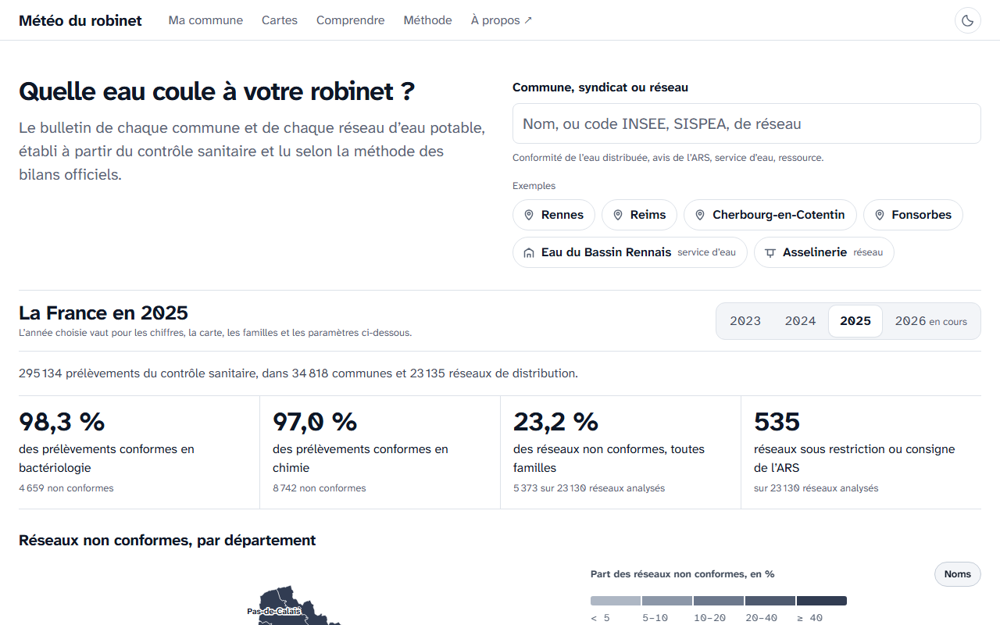

# Météo du robinet

Les données publiques de l'eau potable en France, de la ressource au robinet :
**[robinet.hydroforge.fr](https://robinet.hydroforge.fr)**

[](https://github.com/aurelien032-glitch/meteo-du-robinet/actions/workflows/tests.yml)



Pour chaque commune et chaque réseau de distribution, la plateforme rassemble :

- la qualité de l'eau distribuée, **réseau par réseau**, selon la méthode du bilan officiel de chaque famille de
  paramètres (pesticides, nitrates, PFAS, bactériologie, métaux et minéraux) ;
- les avis sanitaires des agences régionales de santé : restrictions de consommation, consignes d'ébullition,
  recommandations aux publics sensibles, lus phrase par phrase dans les conclusions des prélèvements ;
- les services d'eau et le prix de l'eau (observatoire SISPEA) ;
- la ressource : prélèvements, nappes, restrictions sécheresse du jour.

L'unité de mesure est le réseau de distribution, celui qu'analyse le contrôle sanitaire : la plateforme ne compte
pas des communes « concernées » et n'estime aucune population. Le vert, l'orange et le rouge ne jugent que l'eau
d'un réseau ; les cartes et les chiffres agrégés restent neutres.

## Organisation

| Dossier | Contenu |
|---|---|
| `pipeline/` | Chaîne de traitement en Python (DuckDB, pandas, Typer) : téléchargement des données publiques, agrégats, fichiers JSON statiques du site. |
| `web/` | Site React et TypeScript (Vite), cartes MapLibre, graphiques ECharts. Aucun serveur applicatif : le site lit les fichiers produits par la chaîne. |
| `scripts/` | Rafraîchissement mensuel complet (`refresh.ps1`). |

## Lancer le site

Il faut Node 22 ou plus. Les données publiées (environ 130 Mo) ne sont pas versionnées sur `main` : la branche
`gh-pages`, qui porte le site en ligne, en contient la dernière version.

```bash
git clone https://github.com/aurelien032-glitch/meteo-du-robinet.git
cd meteo-du-robinet
git fetch origin gh-pages
git archive FETCH_HEAD data | tar -x -C web/public    # données publiées → web/public/data
cd web
npm ci
npm run dev
```

## Reconstruire les données

Il faut Python 3.12 ou plus et [uv](https://docs.astral.sh/uv/).

```bash
cd pipeline
uv sync
uv run robinet download     # archives annuelles du contrôle sanitaire (data.gouv.fr)
uv run robinet build        # agrégats et fichiers du site, dans web/public/data
uv run robinet sispea       # services d'eau et prix
uv run robinet recherche    # index de la recherche
```

La séquence complète, interrogations des API Hub'Eau comprises, est dans `scripts/refresh.ps1`.

## Tests

```bash
cd pipeline && uv run pytest -q
cd web && npm test && npm run typecheck
```

Ils tournent à chaque envoi sur `main` (GitHub Actions). `npm run review` capture en plus chaque page en bureau,
mobile, sombre et couleurs forcées, et audite l'accessibilité (axe-core, WCAG 2.2 AA) ; il demande Playwright.

## Sources

Données publiques, réutilisées pour l'essentiel sous la Licence Ouverte 2.0 d'Etalab ; chaque source et son
producteur sont cités sur la page [Méthode](https://robinet.hydroforge.fr/methode) du site.

| Source | Producteur | Contenu |
|---|---|---|
| Contrôle sanitaire de l'eau distribuée (SISE-Eaux) | Ministère chargé de la Santé, ARS | chaque analyse et la conclusion de chaque prélèvement |
| SISPEA | Office français de la biodiversité | prix, rendement, renouvellement, mode de gestion des services |
| BNPE | Office français de la biodiversité | volumes prélevés pour l'eau potable, par ouvrage |
| BNV-D | Office français de la biodiversité | ventes de produits phytopharmaceutiques par département |
| ADES, piézométrie | BRGM | qualité et niveau des eaux souterraines (Hub'Eau) |
| Naïades | Agences de l'eau | qualité des cours d'eau (Hub'Eau) |
| VigiEau | Ministère de la Transition écologique | restrictions sécheresse en vigueur, interrogées en direct |
| Contours administratifs | Etalab, IGN | départements et communes |

## Auteur et licence

Réalisé par Aurélien Nogent, ingénieur en réseaux d'eau potable : [hydroforge.fr](https://hydroforge.fr)
(formulaire de contact).

Code sous licence MIT (fichier `LICENSE`). Les données restent sous la licence de leurs producteurs ; les polices
Atkinson Hyperlegible, sous SIL Open Font License (`web/public/fonts/atkinson/OFL.txt`).
